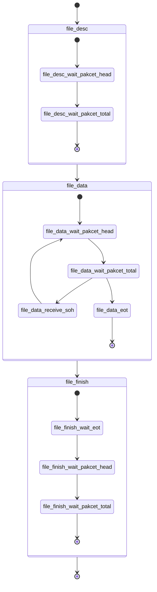

# AAA

## YMODEM 接收

### 读取 YMODEM 包头

```flow
st_func_entry=>start: wait_pakcet_head(io_handle, i_poll_ms, o_size)
op_read_char=>operation: ret_read = ymodem_read(fd, &ch, 1)
cond_ret_read=>condition: ret_read > 0
op_process=>operation: SOH/EOT return, other case send 'C'
op_timeout=>operation: timeout send 'C'
e_end=>end: return

st_func_entry->op_read_char->cond_ret_read
cond_ret_read(yes)->op_process->e_end
cond_ret_read(no)->op_timeout->e_end
```

### 读取 YMODEM 数据包与校验

```flow
st_func_entry=>start: wait_pakcet_total(io_handle, i_size, i_poll_ms)
op_read_buf=>operation: sum_cnt += ymodem_read(fd, buf, size-sum_cnt)
cond_total_size=>condition: sum_cnt >= size
op_process=>operation: valid:file_desc_cb, invalid:send NAK
op_timeout=>operation: timeout send 'C'
e_end=>end: return

st_func_entry->op_read_buf->cond_total_size
cond_total_size(yes)->op_process->e_end
cond_total_size(no)->op_timeout->e_end
```

### YMODEM 接收状态


