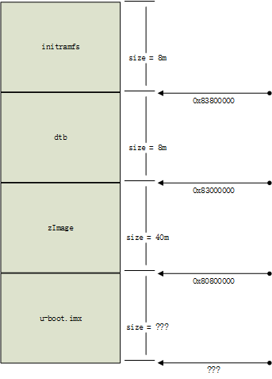
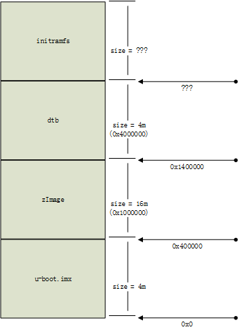

---
步骤一:删除多余的 .vbs ,只留下 mfgtool2-yocto-mx-evk-nand.vbs
> 为什么?太多碍眼,板子是类似imx6ull-14x14-evk的吧!其他貌似都不合适,所以选了 mfgtool2-yocto-mx-evk-nand.vbs 这个.

步骤二:删除 files和firmware 多余的文件,只留下fsl-image-mfgtool-initramfs-imx_mfgtools.cpio.gz.u-boot
> 为什么?太多碍眼,uboot(*.imx) kernel(zImage) dtb(*.dtb) rootfs(*.tar.bz2)确实是需要的,但是后续通过更改 ucl2.xml 可以确定需要的文件,通过 MfgTool.log 也可以查看错误和缺少的文件,fsl-image-mfgtool-initramfs-imx_mfgtools.cpio.gz.u-boot 这个文件是运行于RAM的rootfs,不能删除,并且里面有一些命令,比如:nand read和nand write

步骤三:查看 ucl2.xml 文件(重要)
> 只看 `ifdev="MX6ULL"` 部分

> 只看 ``<LIST name="NAND Flash" desc="Choose NAND as media">`` 部分

> 删除多余内容,整理之后,清晰多了

```xml
<LIST name="NAND Flash" desc="Choose NAND as media">

    <!-- file ="firmware/u-boot.imx" 这是 firmware 中u-boot镜像 ,改个名字 u-boot.imx,方便直接替换u-boot不要再次改名了 -->
	<CMD state="BootStrap" type="boot" body="BootStrap" file ="firmware/u-boot.imx" ifdev="MX6ULL">Loading U-boot</CMD>

    <!-- file="firmware/zImage" 这是 firmware 中的内核镜像, address="0x80800000" 中这个 "0x80800000" 是位于RAM中的地址 -->
	<CMD state="BootStrap" type="load" file="firmware/zImage" address="0x80800000"
		loadSection="OTH" setSection="OTH" HasFlashHeader="FALSE" ifdev="MX6SL MX6SX MX7D MX6UL MX6ULL">Loading Kernel.</CMD>

    <!-- file="firmware/%initramfs%" 这是 firmware 中的rootfs, address="0x83800000" 中这个 "0x83800000" 是位于RAM中的地址 -->
	<CMD state="BootStrap" type="load" file="firmware/%initramfs%" address="0x83800000"
				loadSection="OTH" setSection="OTH" HasFlashHeader="FALSE" ifdev="MX6SL MX6SX MX7D MX6UL MX6ULL">Loading Initramfs.</CMD>

    <!-- file="firmware/imx6ull-14x14-evk-test.dtb" 这是 firmware 中的dtb, 改个名字 imx6ull-14x14-evk-test.dtb, address="0x83000000" 中这个 "0x83000000" 是位于RAM中的地址 -->
	<CMD state="BootStrap" type="load" file="firmware/imx6ull-14x14-evk-test.dtb" address="0x83000000"
		loadSection="OTH" setSection="OTH" HasFlashHeader="FALSE" ifdev="MX6ULL">Loading device tree.</CMD>

	<CMD state="BootStrap" type="jump" > Jumping to OS image. </CMD>

	<!-- 下面files中文件名也改一下 -->
	<!-- 例如:flash_erase,nandwrite...这些命令都是上面这个rootfs提供的,所以不能删除原始的rootfs(即:fsl-image-mfgtool-initramfs-imx_mfgtools.cpio.gz.u-boot) -->
	<!-- 例如:/dev/mtd...这些分区都是 uboot 通过参数传递上来的,所以下面会说到 `bootcmd_mfg` 这个参数传递的分区信息要与 `mtdparts` 匹配,至少我是这样理解的 -->

	<!--burn the uboot to NAND: -->
	<CMD state="Updater" type="push" body="$ mount -t debugfs debugfs /sys/kernel/debug">Mounting debugfs</CMD>
	<CMD state="Updater" type="push" body="$ flash_erase /dev/mtd%part_uboot% 0 0">Erasing Boot partition</CMD>
	<CMD state="Updater" type="push" body="send" file="files/u-boot.imx" ifdev="MX6ULL">Sending u-boot.bin</CMD>
	<CMD state="Updater" type="push" body="$ kobs-ng init -x -v --chip_0_device_path=/dev/mtd%part_uboot% $FILE">Flashing Bootloader</CMD>

	<!--burn the kernel to NAND: -->
	<CMD state="Updater" type="push" body="$ flash_erase /dev/mtd%part_kernel% 0 0">Erasing Kernel partition</CMD>
	<CMD state="Updater" type="push" body="send" file="files/zImage">Sending kernel zImage</CMD>
	<CMD state="Updater" type="push" body="$ nandwrite -p /dev/mtd%part_kernel% -p $FILE">Flashing Kernel</CMD>


	<CMD state="Updater" type="push" body="$ flash_erase /dev/mtd%part_dtb% 0 0">Erasing dtb partition</CMD>
	<CMD state="Updater" type="push" body="send" file="files/imx6ull-14x14-evk-test.dtb" ifdev="MX6ULL">Sending Device Tree file</CMD>
	<CMD state="Updater" type="push" body="$ nandwrite -p /dev/mtd%part_dtb% -p $FILE">Flashing dtb</CMD>

	<!--burn the rootfs to NAND: -->
	<CMD state="Updater" type="push" body="$ flash_erase /dev/mtd%part_rootfs% 0 0">Erasing rootfs partition</CMD>
	<CMD state="Updater" type="push" body="$ ubiformat /dev/mtd%part_rootfs%"/>
	<CMD state="Updater" type="push" body="$ ubiattach /dev/ubi_ctrl -m %part_rootfs%">Attaching UBI partition</CMD>
	<CMD state="Updater" type="push" body="$ ubimkvol /dev/ubi0 -Nrootfs -m"/>
	<CMD state="Updater" type="push" body="$ mkdir -p /mnt/mtd%part_rootfs%"/>
	<CMD state="Updater" type="push" body="$ mount -t ubifs ubi0:rootfs /mnt/mtd%part_rootfs%"/>
	<CMD state="Updater" type="push" body="pipe tar -jxv -C /mnt/mtd%part_rootfs%" file="files/rootfs.tar.bz2" ifdev="MX6UL MX7D MX6ULL">Sending and writting rootfs</CMD>
	<CMD state="Updater" type="push" body="frf">Finishing rootfs write</CMD>
	<CMD state="Updater" type="push" body="$ umount /mnt/mtd%part_rootfs%">Unmounting rootfs partition</CMD>

	<CMD state="Updater" type="push" body="$ echo Update Complete!">Done</CMD>
</LIST>
```
> 所以语句 `<CMD state="BootStrap" type="jump" > Jumping to OS image. </CMD>` 之后RAM内存分区大致如下:
>
> 
>
> 

步骤三:修改 u-boot 源码+编译(重要)
> 源码:http://git.freescale.com/git/cgit.cgi/imx/uboot-imx.git/

> 版本:rel_imx_4.1.15_2.1.0_ga

> 修改文件:./uboot-imx/include/configs/mx6ullevk.h

```c
#define PHYS_SDRAM_SIZE // 修改 RAM 大小,为什么改这里?听别人说的

// 分区的大小,这个应该是任意的,但是要和 bootcmd 符合吧???我觉得应该是,因为在 ucl2.xml 中要擦除和写入 files 中的内容
#define CONFIG_MFG_NAND_PARTITION "mtdparts=gpmi-nand:4m(boot),16m(kernel),4m(dtb),-(rootfs) "

#define CONFIG_MFG_ENV_SETTINGS \
"mfgtool_args=setenv bootargs console=${console},${baudrate} " \
    CONFIG_BOOTARGS_CMA_SIZE \
	"rdinit=/linuxrc " \
	"g_mass_storage.stall=0 g_mass_storage.removable=1 " \
	"g_mass_storage.file=/fat g_mass_storage.ro=1 " \
	"g_mass_storage.idVendor=0x066F g_mass_storage.idProduct=0x37FF "\
	"g_mass_storage.iSerialNumber=\"\" "\
	CONFIG_MFG_NAND_PARTITION \
	"clk_ignore_unused "\
	"\0" \
"bootcmd_mfg=run mfgtool_args;bootz 0x80800000 0x83800000 0x83000000;\0" \

#if defined(CONFIG_SYS_BOOT_NAND)
#define CONFIG_EXTRA_ENV_SETTINGS \
    CONFIG_MFG_ENV_SETTINGS \
    "panel=TFT43AB\0" \
    "console=ttymxc0\0" \
    "bootargs=console=ttymxc0,115200 ubi.mtd=3 "  \
        "root=ubi0:rootfs rootfstype=ubifs "		     \
        CONFIG_BOOTARGS_CMA_SIZE \
        "mtdparts=gpmi-nand:4m(boot),16m(kernel),4m(dtb),-(rootfs)\0"\    // 类似 CONFIG_MFG_NAND_PARTITION
    "bootcmd=nand read 0x80800000 0x400000 0x1000000;"\ // 加载kernel nand read 目标地址(RAM地址) 源地址(nandflash偏移地址) 大小
        "nand read 0x83000000 0x1400000 0x400000;"\ // 加载dtb
        "bootz 0x80800000 - 0x83000000\0" // 这个目前不知道是啥意思

#else
#endif
```

> 语句`#define CONFIG_MFG_ENV_SETTINGS`中的参数需要与 ucl2.xml 中设定的地址匹配,希望我的理解是正确的 QAQ
>
> 语句`#define CONFIG_MFG_NAND_PARTITION`中的分区设置是在 USB OTG mfg_tools 情况下启动后,对 NAND FLASH 的分区???我是这样理解的
>
> 语句`mtdparts=gpmi-nand:4m(boot),16m(kernel),4m(dtb),-(rootfs)\0`中的分区设置是在 NAND FLASH 情况下启动后,传递给 kernel 或 重新设置分区 的参数???
>
> 语句`bootcmd=...`中偏移量与大小需要与`mtdparts=gpmi-nand:...`匹配,如上设置之后, NAND FLASH 的具体分区如下:
>
> 
>
> 

步骤四:修改 kernel 源码+编译(重要)
> 源码:http://git.freescale.com/git/cgit.cgi/imx/linux-imx.git/

> 版本:rel_imx_4.1.15_2.1.0_ga

> 修改文件:./linux-imx/arch/arm/boot/dts/imx6ull-14x14-evk-gpmi-weim.dts

> 为什么修改这个?在没有任何修改 mfg_tools 工具内容之前我直接运行 mfgtool2-yocto-mx-evk-nand.vbs 是需要 imx6ull-14x14-evk-gpmi-weim.dts.dtb 的,所以就顺便看看.

> 原来这个文件里面的内容有 nand flash 相关的内容,虽然我看不懂,但是多少有点关系.
> 另外 &qspi + &usdhc2 我不知道有啥用,删除了吧!应该不影响.
> 修改文件:./linux-imx/arch/arm/boot/dts/imx6ull-14x14-evk.dts
> 这里面也有很多看不懂的东西,只能GOOGLE一下搜索看看,看不懂或者感觉没用的我都删除了.

> make CROSS_COMPILE=arm-linux-gnueabihf- ARCH=arm imx_v7_mfg_defconfig

> make CROSS_COMPILE=arm-linux-gnueabihf- ARCH=arm zImage

> 生成zImage,覆盖 mfg_tools 中的 files 和 firmware 文件夹中的zImage

> make CROSS_COMPILE=arm-linux-gnueabihf- ARCH=arm dtbs

> 生成对应的.dtb,覆盖 mfg_tools 中的 files 和 firmware 文件夹中的dtb

---

感谢阅读,如果有什么问题或者我理解错误的地方请帮忙矫正,万分感谢!
